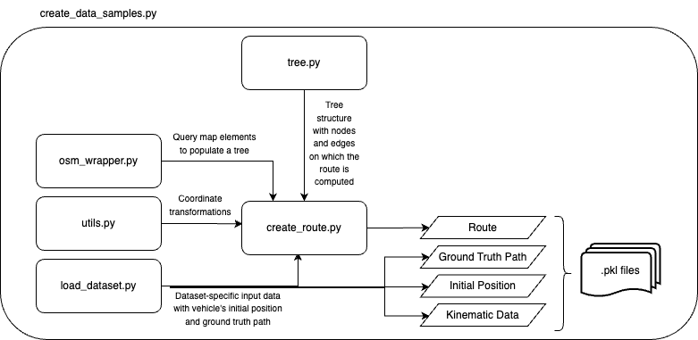

# sdmap-route-devkit

Launch json for preprocessing:

```
{
    "name": "Load Map Kinematics",
    "type": "debugpy",
    "request": "launch",
    "program": "${workspaceFolder}/load_mapkinematics.py",
    "args": [
        "--input=/staging/dl_madmaps/data/dl2_hp_train_default",
        "--output=test_osm/",
        "--workers=1",
        "--debug"
    ],
    "console": "integratedTerminal"
}, 
```
## Diagram

